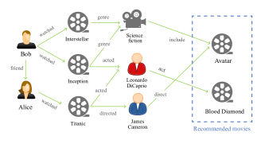

# Knowledge Based Recommendations
A knowledge based recommendation is one in which knowledge about the item or user preferences are used to make a recommendation.

</img>

<a href="https://www.groundai.com/project/a-survey-on-knowledge-graph-based-recommender-systems/1">Image reference</a>

Knowledge based recommendations are pretty common when purchasing luxury items.

Often a rank based algorithm is provided along with knowledge based recommendations to bring the most popular items in particular categories to the user's attention.

In the next concept, you will get some practice implementing this type of recommendation for the MovieTweetings dataset.